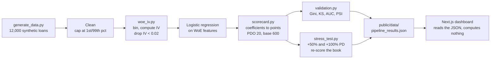

# Credit Risk Scorecard

[](https://github.com/Balisa50/credit-risk-scorecard/actions/workflows/ci.yml)
[](LICENSE)

Basel II-compliant credit scorecard for West African microfinance. Logistic regression with WoE encoding, built on 12,000 synthetic loans calibrated to microfinance risk profiles in the region.

Why build this: most credit risk tooling assumes the data and risk distribution of mature Western markets. West African microfinance has different risk drivers - mobile money usage, agricultural income seasonality, informal employment - so the feature importance looks different.

## How it works



The dashboard is a renderer. Every number it shows was written by the Python
run, so the page and the model can never disagree.

## Pipeline

1. **Data cleaning** - handle informal income fields, missing collateral data, outlier capping at 1st/99th percentile
2. **WoE/IV feature selection** - bins continuous variables, calculates Information Value per feature. Drops anything below IV 0.02
3. **Logistic regression** - fit on WoE-transformed features, convert coefficients to Basel II integer scorecard points (PDO = 20, base score = 600)
4. **Validation** - Gini 0.29, KS 0.23 on the time-based holdout. PSI 0.008 across validation windows (stable)
5. **Stress testing** - shift default rate +50% (economic stress), +100% (severe), shift feature distributions, re-score the book

## Stack

- Python - pandas, NumPy, scikit-learn
- Next.js + Recharts - scorecard UI and stress test visualiser

## Prerequisites

- Python 3.10 or newer
- Node.js 18 or newer

## Installation

```bash
git clone https://github.com/Balisa50/credit-risk-scorecard.git
cd credit-risk-scorecard

pip install -r pipeline/requirements.txt
npm install
```

## Usage

Run the model. It regenerates the loan book, fits the scorecard, validates it,
stress tests it, and writes every figure the dashboard displays:

```bash
cd pipeline
python run_pipeline.py
# -> ../public/data/pipeline_results.json
```

Then serve the dashboard:

```bash
npm run dev        # http://localhost:3000
```

The synthetic book is seeded, so a fresh clone reproduces the numbers in the
table below exactly.

## Layout

```
pipeline/
  generate_data.py   synthetic loan book, seeded
  run_pipeline.py    orchestrates the run, writes the JSON
  src/
    woe_iv.py        binning, weight of evidence, information value
    scorecard.py     coefficients to Basel II integer points
    validation.py    Gini, KS, AUC, PSI
    stress_test.py   scenario shifts and re-scoring
app/, components/    Next.js dashboard
public/data/         the pipeline output the dashboard reads
```

## Tests

```bash
pip install pytest
cd pipeline
pytest                         # 16 tests on the maths
python check_reproducible.py   # a fresh run must match the committed results
```

The tests assert identities, not this book's figures. Pinning Gini to 0.268
would break the moment the generator is retuned and would catch no real defect.
These check that the WoE bins account for every row, that WoE is the log ratio
of the two distributions, that no information value component can come out
negative, and that a predictive feature outscores pure noise.

The one worth reading is `test_doubling_the_odds_moves_the_score_by_exactly_pdo`.
That is the defining property of a points scorecard: the score is affine in the
log-odds with slope `-PDO / ln 2`, so moving the linear predictor by exactly
`ln 2` has to move the score by exactly 20 points and by nothing else. A broken
points conversion fails it immediately.

CI runs the tests, runs the full pipeline, and fails if a fresh seeded run does
not reproduce `public/data/pipeline_results.json`. The comparison is a 0.1%
relative tolerance rather than exact equality, because lbfgs and the platform
BLAS differ in the last digits between Windows and Linux. Structure is compared
exactly. The sampled ROC and KS curves are excluded from the numeric part,
because a step function rendered at fixed sample points can jump a whole step
on a sub-tolerance score change; Gini, which is computed from the whole curve,
is still checked. The results table below and the model can no longer drift apart
silently, which is what happened before: it quoted a Gini of 0.29 against an
actual 0.268.

## Results

Every figure below is read from `public/data/pipeline_results.json`, the file
`pipeline/run_pipeline.py` writes and the dashboard renders. Re-running the
pipeline on a clean clone reproduces them.

| Metric | Train | Test | Usual threshold |
|--------|-------|------|-----------------|
| Gini coefficient | 0.286 | **0.268** | > 0.4 |
| KS statistic | 0.214 | **0.212** | > 0.3 |
| AUC-ROC (derived, `(Gini+1)/2`) | 0.643 | **0.634** | - |
| PSI, early vs late vintages | - | **0.002** | < 0.1 |

Book: 12,000 loans, $9.43m, 13.3% default rate, split 8,531 train / 3,469 test.

Discrimination falls short of the usual thresholds, and that is a property of
the synthetic data rather than the modelling. Of 17 candidate features, 10
clear the IV 0.02 cut and none reaches Strong. The best is `dti_ratio` at IV
0.147, followed by `previous_defaults` at 0.106 and `dpd_history_days` at
0.105; the ten selected features sum to roughly 0.59 IV. A scorecard cannot
separate better than its features do.

The stability and explainability layers are the parts worth reading here: the
WoE bins, the coefficient-to-points conversion, and the fact that PSI reports
Stable while the realised default rate moves from 12.3% to 15.9% across the
vintages. That gap is the point. PSI measures the score distribution, not the
outcome, and a book can drift in risk without drifting in score.

## Live

[credit-risk-ab.vercel.app](https://credit-risk-ab.vercel.app)

## Licence

MIT. See [LICENSE](LICENSE). The loan book is synthetic and carries no
real borrower data.
